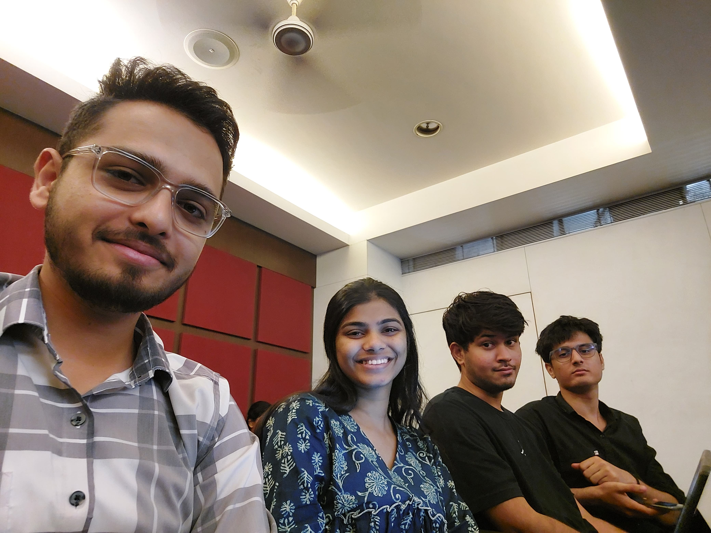

# 🏥 VitalCoach - AI-Powered Personal Health Coach  

## 🚀 About the Project  

**VitalCoach** is an AI-powered personal health assistant designed to help individuals manage chronic conditions like diabetes and hypertension. It offers real-time health tracking, personalized recommendations, and progress insights to enhance patient well-being.  

---

## 🏆 Hackathon Recognition  

This project was built for **Hack2Infinity: The Infinite AI Hackathon**, an AI-focused competition organized by **DMX and the Student Council** at **Rajiv Gandhi Institute of Technology**.  

✨ **Team NoName.json** was selected as a **Finalist** in this prestigious event! 🏅  

---

## 🔥 Features  

✅ **Real-Time Health Monitoring** – Track step count, heart rate, glucose levels, and more.  
✅ **Personalized AI Recommendations** – Get AI-driven diet plans, exercise routines, and wellness tips.  
✅ **Goal Tracking & Incentives** – Set fitness goals and earn rewards upon completion.  
✅ **Progressive Web App (PWA) Support** – Installable as a **PWA** for a seamless mobile experience.  
✅ **Achievements & Profile Management** – Track streaks, badges, and medical history.  

---

## 🛠️ Tech Stack  

- **Frontend**: React, JSX, Tailwind CSS  
- **State Management**: Context API / Redux  
- **Backend**: Node.js (future scope)  
- **Database**: MongoDB (future scope)  
- **PWA**: Service Worker, Web App Manifest  

---

## 📂 Project Directory Structure  

```bash
rsayyed591-vitalcoach/
├── README.md
├── eslint.config.js
├── index.html
├── package.json
├── postcss.config.js
├── tailwind.config.js
├── vite.config.js
├── public/
│   ├── manifest.json
│   ├── sw.js
│   └── gif/
│       ├── exercise/
│       └── yoga/
└── src/
    ├── App.jsx
    ├── index.css
    ├── main.jsx
    ├── components/
    │   ├── ChatArogya.jsx
    │   ├── ExerciseModal.jsx
    │   ├── GoalModal.jsx
    │   ├── GoalSettingModal.jsx
    │   ├── MealLogModal.jsx
    │   ├── MedicalFormModal.jsx
    │   ├── MobileNav.jsx
    │   └── ui/
    │       ├── badge.jsx
    │       ├── button.jsx
    │       ├── card.jsx
    │       ├── dialog.jsx
    │       ├── dropdown-menu.jsx
    │       ├── modal.jsx
    │       ├── modal2.jsx
    │       └── progress.jsx
    ├── pages/
    │   ├── Auth.jsx
    │   ├── Dashboard.jsx
    │   ├── HeathSummary.jsx
    │   ├── OTP.jsx
    │   ├── Profile.jsx
    │   ├── Recommendations.jsx
    │   └── StepTracker.jsx
    └── services/
        └── api.js
```

## 👥 Team - NoName.json  

| Name                | GitHub Profile |
|---------------------|---------------|
| **Rehan Sayyed**    | [@rsayyed591](https://github.com/rsayyed591) |
| **Vivek Chouhan**   | [@viv696969](https://github.com/viv696969) |
| **Sanskruti Bansode** | [@sanskruti2003](https://github.com/sanskruti2003) |
| **Rahil Shaikh**    | [@Rahil71](https://github.com/Rahil71) |

---

## 📸 Team Image  

<p align="center">
  
</p>

---

## ⚡ How to Run the Project  

1️⃣ **Clone the Repository:**  
```bash
git clone https://github.com/rsayyed591/vitalcoach.git
```
2️⃣ **Navigate to the Project Folder:**  
```bash
cd rsayyed591-vitalcoach
```
3️⃣ **Install Dependencies:**  
```bash
npm install
```
4️⃣ **Run the Development Server:**  
```bash
npm run dev
```
5️⃣ **Open in Browser:**  
Visit `http://localhost:5173`  

---

## 📜 License  

This project is open-source under the **MIT License**. Feel free to modify and contribute.  

---

📢 **For contributions, issues, or queries, reach out to us via GitHub!** 🚀  

```
